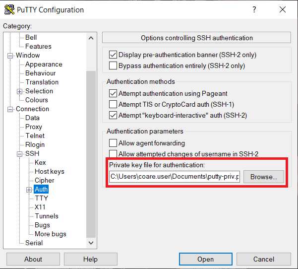

# Logging in

The following are procedures for logging in to the COARE HPC via the following OS: Windows, Mac, and Linux.

## Table of Contents
* [For Windows](#for-windows)
  * [PuTTY](#putty)
  * [Command Prompt (for windows 10 only)](#command-prompt-for-windows-10-only)
* [For Mac/Linux](#for-maclinux)

## For Windows
### PuTTY
1. Download and run **PuTTY** application.
    * [32-bit:](https://the.earth.li/~sgtatham/putty/latest/w32/putty.exe)
    * [64-bit:](https://the.earth.li/~sgtatham/putty/latest/w64/putty.exe) 
2. Set port number to **22** and the **Host Name** to **saliksik.asti.dost.gov.ph.**


3. On the left panel under Category, collapse the **Connection** option and select the **SSH** option, and then click **Auth**. Select **Browse** to attach your **private key** (.ppk file) for authentication. Then click Open.


4. Select **Yes** when prompted by a PuTTY Security Alert Window.


5. When the terminal opens, enter your COARE credentials that should have been sent to your email.
6. You are now inside the HPC frontend if you see this (see image below) on your terminal.


    NOTES: 
      * Accessing HPC must be passwordless unless you have a passphrase during the generating of keys.
      * If you want to use your key (generated using PuTTY) in OpenSSH, check this tutorial on converting PuTTY (.ppk) key to SSH Key.
      * You cannot use your OpenSSH keys to PuTTY and vice versa.

### Command Prompt (for windows 10 only)
1. Open **Command Prompt** or **Windows PowerShell**.
2. Type command:
```
ssh <username>@saliksik.asti.dost.gov.ph
```
| Flag | Description | 
| -------- | -------- | 
| -i     | Data     | 
| Data     | Data     | 
| Data     | Data     | 
## For Mac/Linux